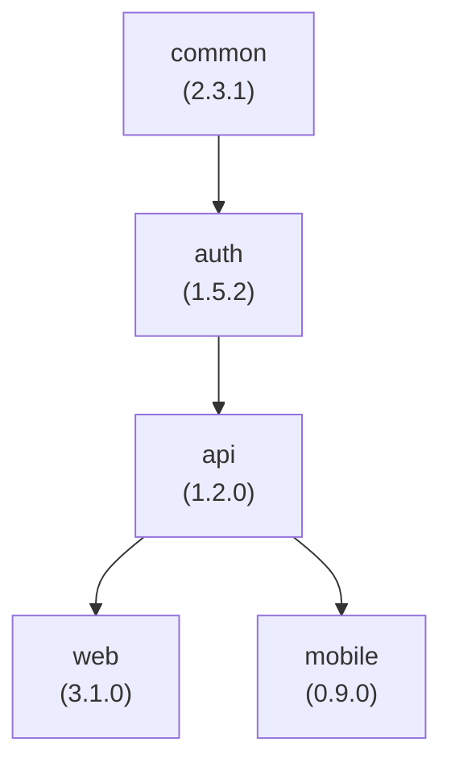

# Monorepo Setup Example

A complete example of setting up Versu for a monorepo with multiple interdependent modules. It uses the running example from [Multi-Module Projects](/guide/concepts/multi-module): the `my-monorepo` workspace with the `common`, `auth`, `api`, `web` and `mobile` modules.

## Project Structure

```text
my-monorepo/
├── packages/
│   ├── common/
│   │   ├── src/
│   │   ├── package.json
│   │   └── CHANGELOG.md
│   ├── auth/
│   │   ├── src/
│   │   ├── package.json
│   │   └── CHANGELOG.md
│   ├── api/
│   │   ├── src/
│   │   ├── package.json
│   │   └── CHANGELOG.md
│   ├── web/
│   │   ├── src/
│   │   ├── package.json
│   │   └── CHANGELOG.md
│   └── mobile/
│       ├── src/
│       ├── package.json
│       └── CHANGELOG.md
├── versu.config.js
├── package.json
└── README.md
```

## Dependency Graph



## Configuration

Declare the workspace members in the root `package.json` - the Node adapter derives the modules and the dependency graph from it:

```json
{
  "name": "my-monorepo",
  "private": true,
  "workspaces": ["packages/*"]
}
```

The dependency graph shown above comes from regular dependency declarations between packages, e.g. in `packages/auth/package.json`:

```json
{
  "name": "@my-org/auth",
  "version": "1.5.2",
  "dependencies": {
    "@my-org/common": "^2.3.1"
  }
}
```

Then configure Versu itself:

```javascript
// versu.config.js
export default {
  plugins: ["@versu/plugin-node"],
  versioning: {
    cascadeRules: {
      // A dependency bump cascades to dependents as a patch bump
      stable: {
        major: "major",
        minor: "patch",
        patch: "patch",
      },
    },
  },
};
```

## Step-by-Step Setup

### 1. Install Versu

```bash
npm install -D @versu/cli @versu/plugin-node
```

### 2. Create Configuration

```bash
touch versu.config.js
# Copy the configuration above
```

### 3. Preview with a Dry Run

```bash
npx versu run --dry-run
```

Check the log output: module discovery should list all workspace packages (`:`, `:packages:common`, `:packages:auth`, ...), and the calculated bumps should reflect your commits and the cascade rules.

### 4. Release

```bash
npx versu run
```

For a `feat` commit touching `packages/common`, one run will:

1. Bump `common` with a minor bump (`2.3.1` → `2.4.0`)
2. Cascade a patch bump to its dependent `auth` (`1.5.2` → `1.5.3`) - and transitively to `api` (`1.2.0` → `1.2.1`), `web` (`3.1.0` → `3.1.1`) and `mobile` (`0.9.0` → `0.9.1`)
3. Update every affected `package.json`, including internal dependency ranges (`^2.3.1` → `^2.4.0`)
4. Write a `CHANGELOG.md` per changed module plus the root changelog
5. Commit, tag each changed module (`@my-org/common@2.4.0`, `@my-org/auth@1.5.3`, ...) and push

Note the patch cascades come from this example's tuned `cascadeRules` - with the default same-level rules, the dependents would all receive minor bumps instead, as shown in [Dependency Cascade](/guide/concepts/dependency-cascade).

::: tip
Commits are attributed to modules by path: a commit that only touches `packages/common` bumps only `common` (plus its cascade). Keep commits scoped to one package when you can.
:::

## Next Steps

- [GitHub Actions](/tools/github-action) - Full automation
- [Advanced Configuration](/guide/config/configuration-file) - More options
- [Dependency Cascade](/guide/concepts/dependency-cascade) - Deep dive

---

Ready to automate everything? Check out the [GitHub Actions Guide](/tools/github-action)!
