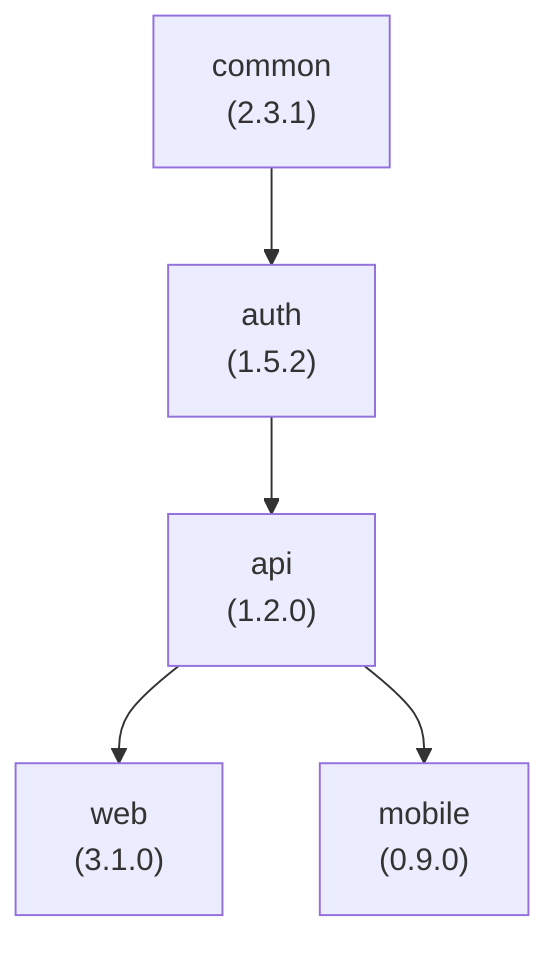
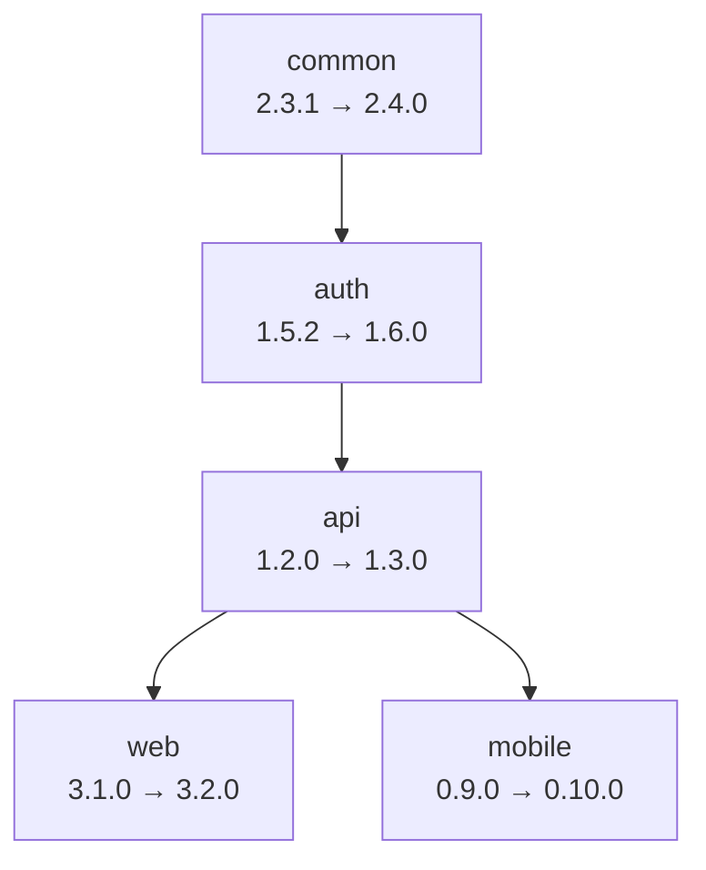

# Dependency Cascade

Dependency cascade is the automatic versioning of dependent modules when their dependencies are updated.

This page continues the running example from [Multi-Module Projects](/guide/concepts/multi-module): a monorepo with five modules, where `auth` depends on `common`, `api` depends on `auth`, and both `web` and `mobile` depend on `api`:



## The Problem

In multi-module projects, manually managing dependent versions is tedious and error-prone:

When `common` is updated:

- Did you remember to update `auth`'s dependency on `common`?
- What about `api`, which depends on `auth`?
- And `web` and `mobile` at the end of the chain?
- What version bump should each dependent get?

## The Solution

Versu automatically handles dependency cascades by analyzing module relationships and intelligently updating all dependents.

## How Cascade Works

### 1. Analyze Changes

Versu detects which modules changed:

```text
Modified files:
✓ packages/common/src/index.ts → common module affected
✓ packages/common/CHANGELOG.md → common module affected
✗ packages/api/docs/README.md  → api module not affected
```

### 2. Calculate Version Bumps

Determine version change for each affected module:

| Module   | Type of Change | Bump Type             |
| -------- | -------------- | --------------------- |
| `common` | feat           | MINOR (2.3.1 → 2.4.0) |
| `auth`   | (unchanged)    | Cascade               |

### 3. Apply Cascade Rules

For modules that depend on changed modules, when using the default cascade rules, dependents get the same bump type as their dependency.

```text
common:  2.3.1 → 2.4.0  (MINOR bump)
auth:    1.5.2 → 1.6.0  (MINOR bump due to cascade)
```

### 4. Recursive Cascade

The cascade applies recursively through the dependency tree, all the way down to `web` and `mobile`:



## Cascade Strategies

By default dependents always get a bump matching their dependency's bump type:

::: code-group

```javascript [versu.config.js]
export default {
  versioning: {
    // ... other versioning options
    cascadeRules: {
      stable: {
        major: "major",
        minor: "minor",
        patch: "patch",
      },
      prerelease: {
        premajor: "premajor",
        preminor: "preminor",
        prepatch: "prepatch",
        prerelease: "prerelease",
      },
    },
  },
};
```

:::

```text
common:  2.3.1 → 3.0.0  (BREAKING, MAJOR bump)
auth:    1.5.2 → 2.0.0  (MAJOR bump due to cascade)
```

This is fully customizable: for each dependency bump type you choose which bump the dependents receive (or `"none"` to stop the cascade). Instead of a full mapping you can also use the shorthand `"match"`, which is equivalent to the default same-level behavior:

::: code-group

```javascript [versu.config.js]
export default {
  versioning: {
    cascadeRules: {
      stable: "match",
      prerelease: "match",
    },
  },
};
```

:::

A common customization in large monorepos is downgrading feature cascades, so a `minor` bump in a dependency only produces a `patch` bump in its dependents - see [Monorepo Setup](/guide/advanced/monorepo#tuning-the-cascade).

## Example Scenarios

All scenarios start from the versions in the dependency graph above and use the default (same-level) cascade rules.

```text
common:  2.3.1
auth:    1.5.2
api:     1.2.0
web:     3.1.0
mobile:  0.9.0
```

### Scenario 1: Bug Fix Cascade

```text
Commit: packages/common/src/fix-bug.ts
Type: fix (patch bump)

Result:
common:  2.3.1 → 2.3.2 (patch)
auth:    1.5.2 → 1.5.3 (cascaded patch)
api:     1.2.0 → 1.2.1 (cascaded patch from auth)
web:     3.1.0 → 3.1.1 (cascaded patch from api)
mobile:  0.9.0 → 0.9.1 (cascaded patch from api)
```

### Scenario 2: Feature Cascade

```text
Commit: packages/auth/src/new-feature.ts
Type: feat (minor bump)

Result:
auth:    1.5.2 → 1.6.0 (minor)
api:     1.2.0 → 1.3.0 (cascaded minor)
web:     3.1.0 → 3.2.0 (cascaded minor from api)
mobile:  0.9.0 → 0.10.0 (cascaded minor from api)
common:  no change (nothing it depends on changed)
```

### Scenario 3: Breaking Change Cascade

```text
Commit: packages/api/src/api-redesign.ts
Type: feat! (major, breaking change)

Result:
api:     1.2.0 → 2.0.0 (major)
web:     3.1.0 → 4.0.0 (cascaded major)
mobile:  0.9.0 → 1.0.0 (cascaded major)
common, auth: no change (upstream of api)
```

## Cascade Order

Versu uses a fixed-point iteration approach to ensure correct cascade order, based on the original dependency graph discovered during analysis.

The algorithm stops when no new modules are affected by the cascade, ensuring all dependents are correctly updated. This ensures correct version calculations at each level.

## Best Practices

### ✅ Do's

- Test cascade behavior in dry-run mode
- Review version bumps before publishing

### ❌ Don'ts

- Create circular dependencies (cascade will fail)
- Publish incompatible versions due to cascade mismatch

## Troubleshooting

### Cascades Not Working?

1. Check module dependencies are correctly defined
2. Verify commit affects the expected modules
3. Use `--dry-run` to preview changes
4. Check configuration file syntax

### Unwanted Cascades?

1. Review your dependency tree for unnecessary links
2. Consider using different cascade strategy

## Next Steps

- [Multi-Module Projects](/guide/concepts/multi-module) - Module configuration
- [Configuration Guide](/guide/config/configuration-file) - Detailed settings
- [Examples](/examples/monorepo-setup) - Real-world examples

---

Ready to understand configuration? Check out the [Configuration Guide](/guide/config/configuration-file)!
