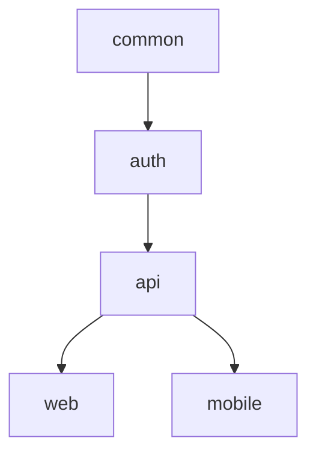
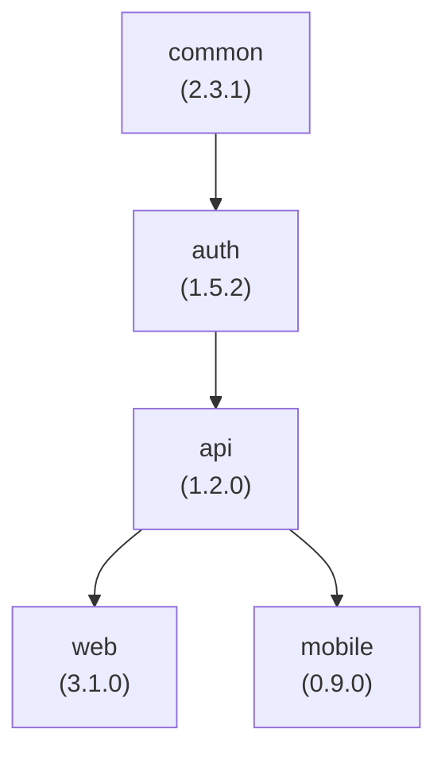

# Multi-Module Projects

Versu is built for monorepos and multi-module projects where each module can be versioned independently.

Throughout this page we'll use a running example for a monorepo with five modules:

- `auth` - authentication module
- `api` - API module
- `common` - shared utilities module
- `web` - web frontend module
- `mobile` - mobile frontend module

They have the following dependency graph:



In this scenario, `auth` depends on `common`, `api` depends on `auth`, and both `web` and `mobile` depend on `api`.
With Versu when a module changes, all of its dependents are affected and will be versioned accordingly.

## Understanding Structure

Our example project looks like:

```text
my-monorepo/
├── packages/
│   ├── common/
│   │   ├── src/
│   │   ├── package.json
│   │   └── CHANGELOG.md
│   ├── auth/
│   │   ├── src/
│   │   ├── package.json
│   │   └── CHANGELOG.md
│   ├── api/
│   │   ├── src/
│   │   ├── package.json
│   │   └── CHANGELOG.md
│   ├── web/
│   │   ├── src/
│   │   ├── package.json
│   │   └── CHANGELOG.md
│   └── mobile/
│       ├── src/
│       ├── package.json
│       └── CHANGELOG.md
├── versu.config.js
├── CHANGELOG.md
└── package.json
```

## Identifying Modules

Plugins are responsible for identifying all modules in a multi-module project. Each plugin needs to follow a contract to provide module information to Versu.

For our example project, the expected output is a JSON object with the following structure:

```json
{
  ":": {
    "name": "my-monorepo",
    "path": ".",
    "affectedModules": [],
    "type": "root",
    "declaredVersion": false
  },
  ":packages:common": {
    "name": "common",
    "path": "packages/common",
    "version": "2.3.1",
    "affectedModules": [
      ":packages:auth",
      ":packages:api",
      ":packages:web",
      ":packages:mobile"
    ],
    "type": "module",
    "declaredVersion": true
  },
  ":packages:auth": {
    "name": "auth",
    "path": "packages/auth",
    "version": "1.5.2",
    "affectedModules": [
      ":packages:api",
      ":packages:web",
      ":packages:mobile"
    ],
    "type": "module",
    "declaredVersion": true
  },
  ":packages:api": {
    "name": "api",
    "path": "packages/api",
    "version": "1.2.0",
    "affectedModules": [
      ":packages:web",
      ":packages:mobile"
    ],
    "type": "module",
    "declaredVersion": true
  },
  ":packages:web": {
    "name": "web",
    "path": "packages/web",
    "version": "3.1.0",
    "affectedModules": [],
    "type": "module",
    "declaredVersion": true
  },
  ":packages:mobile": {
    "name": "mobile",
    "path": "packages/mobile",
    "version": "0.9.0",
    "affectedModules": [],
    "type": "module",
    "declaredVersion": true
  }
}
```

Each key is the module's unique ID in Gradle-style notation: `:` is the root and nested paths become colon-separated segments (e.g., `:packages:common`). Exactly one module of type `root` is required.

In this example, we have the root plus five modules. Each module's `affectedModules` array lists every module downstream of it: when `common` changes, `auth`, `api`, `web` and `mobile` are all affected; when `api` changes, only `web` and `mobile` are.

### Module Properties

| Property | Type | Description | Required |
| ---------- | ------ | ------------- | --------- |
| `name` | string | Name of the module | Yes |
| `path` | string | Relative path to module root | Yes |
| `version` | string | Current version of the module (semver) | No<sup>1</sup> |
| `affectedModules` | array | Array of module identifiers this module affects | Yes |
| `type` | string | Type of module (`root` or `module`) | Yes |
| `declaredVersion` | boolean | Whether the version is explicitly declared in the module's build configuration (vs inherited or absent) | Yes<sup>2</sup> |

<sup>1</sup> The `version` property is optional in the output from plugins and depends on the plugin's implementation. When omitted, Versu treats the module as starting at `0.0.0`.

<sup>2</sup> Modules with `declaredVersion: false` still take part in commit analysis and the dependency cascade, but Versu will not write a version to their build files or create release tags for them - like the root module in the example above, whose version lives only in its children.

Additionally to these properties, plugins can include any other relevant information about the module as needed.

## Independent Versioning

Each module has its own version:

- **common**: 2.3.1
- **auth**: 1.5.2
- **api**: 1.2.0
- **web**: 3.1.0
- **mobile**: 0.9.0

When you run Versu:

1. It analyzes commits affecting each module
2. Each module gets its own version bump
3. Each module has its own `CHANGELOG.md`
4. A root `CHANGELOG.md` is generated

## Commit Scoping

Versu uses Git to determine which commits affect which modules:

```text
# Commit affecting common module
packages/common/src/index.ts changed
feat: add shared validation helper

# Commit affecting web module
packages/web/src/app.ts changed
feat: add dashboard page

# Commit affecting both
packages/common/src/index.ts changed
packages/web/src/app.ts changed
feat!: redesign session handling (breaking change)
```

## Dependency Cascade

When a module changes, its dependents are automatically versioned:



Because dependencies chain, everything downstream of a changed module is affected - that is exactly what each module's `affectedModules` array lists.

<!-- markdownlint-disable-next-line MD036 -->
**Scenario: `common` gets a new feature**

With the default cascade rules (dependents get the same bump level):

- common 2.3.1 → 2.4.0 (minor, from the `feat` commit)
- auth 1.5.2 → 1.6.0 (cascaded minor)
- api 1.2.0 → 1.3.0 (cascaded minor)
- web 3.1.0 → 3.2.0 (cascaded minor)
- mobile 0.9.0 → 0.10.0 (cascaded minor)

<!-- markdownlint-disable-next-line MD036 -->
**Scenario: `web` gets a new feature**

- web 3.1.0 → 3.2.0 (minor)
- common, auth, api, mobile: no change (nothing depends on `web`)

## Best Practices

### ✅ Do's

- Keep module dependencies acyclic
- Document dependencies clearly
- Use descriptive module names
- Update all dependents when making breaking changes
- Version frequently to catch issues early

### ❌ Don'ts

- Create circular dependencies
- Leave undefined dependencies
- Manually manage dependency versions

## Versioning Strategy

Versu supports different strategies for cascading version bumps to dependent modules:

::: code-group

```javascript [versu.config.js]
export default {
  versioning: {
    // ... other versioning options
    cascadeRules: {
      stable: {
        major: "major",
        minor: "minor",
        patch: "patch",
      },
      prerelease: {
        premajor: "premajor",
        preminor: "preminor",
        prepatch: "prepatch",
        prerelease: "prerelease",
      },
    },
  },
}
```

:::

On the example above when stable versioning is being used (i.e. not a pre-release), a major bump in a module will trigger a major bump in its dependents, a minor bump will trigger a minor bump and so on. This is what produced the cascaded minor bumps in the `common` scenario earlier. You can customize this behavior as needed, for both stable and pre-release versions, to fit your project's requirements.

For more information regarding pre-release versioning refer to [Pre-release Versions](/guide/config/prerelease) section in the configuration guide.

## Next Steps

- [Dependency Cascade](/guide/concepts/dependency-cascade) - Deep dive
- [Configuration](/guide/config/configuration-file) - Full configuration guide
- [Examples](/examples/monorepo-setup) - Real-world examples

---

Ready to set up your multi-module project? Check out the [Configuration Guide](/guide/config/configuration-file)!
